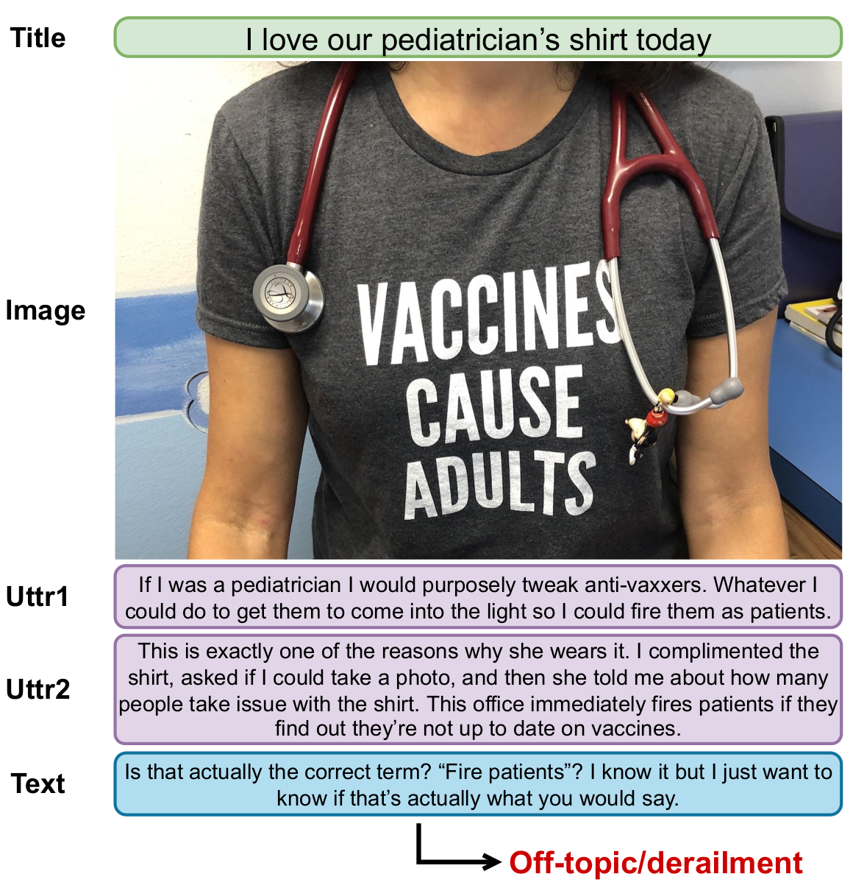
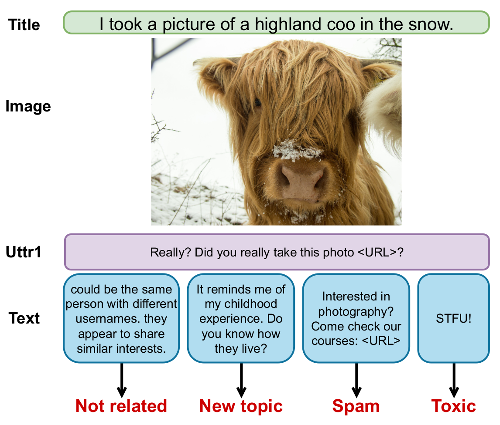

# Multimodal-Conversation-Derailment
MCD dataset for paper "Multimodal Conversation Modelling for Topic Derailment Detection"

<p align="middle">
  
   
</p>

This repo provides the dataset used in the paper. Due to Reddit policy, the data in this repo only contains the comment ids and image urls rather than the texts and image files. You can use the script to access the PushshiftAPI and retrieve the texts/images given the ids and urls. During the time between the data annotation and this paper being published, some submissions/comments might be deleted on Reddit by the author, thus the comments/images are lost. To access the raw data including all texts/images, please email the author stating the purpose of the usage of the dataset and with a consent of not violating Reddit policy.

## Installation
```
pip install -r requirements.txt
```

## Retrieve full data
The script `fetch_data.py` enables to retrieve the data with the PushshiftAPI.
```
usage: fetch_data.py [-h] [-i INPUT_FILE] [-o OUTPUT_FILE] [-id IMAGE_DIR]

optional arguments:
  -h, --help            show this help message and exit
  -i INPUT_FILE, --input_file INPUT_FILE
                        Name of input jsonl file
  -o OUTPUT_FILE, --output_file OUTPUT_FILE
                        Name of output jsonl file to store texts retrieved from Reddit
  -id IMAGE_DIR, --image_dir IMAGE_DIR
                        Output directory to store images retrieved from Reddit

Example:
python fetch_data.py -i data.jsonl -o full_data.jsonl -id images
```

## Citation
```
@inproceedings{li-etal-2022-multimodal,
    title = "Multimodal Conversation Modelling for Topic Derailment Detection",
    author = "Li, Zhenhao  and
      Rei, Marek  and
      Specia, Lucia",
    booktitle = "Findings of the Association for Computational Linguistics: EMNLP 2022",
    month = dec,
    year = "2022",
    address = "Abu Dhabi, United Arab Emirates",
    publisher = "Association for Computational Linguistics"
}
```

## Contact
This repository is maintained by Zhenaho Li. For issues such as missing texts/images, raw data, pre-extracted image features, etc., feel free to contact Zhenhao Li: zhenhao.li18@imperial.ac.uk